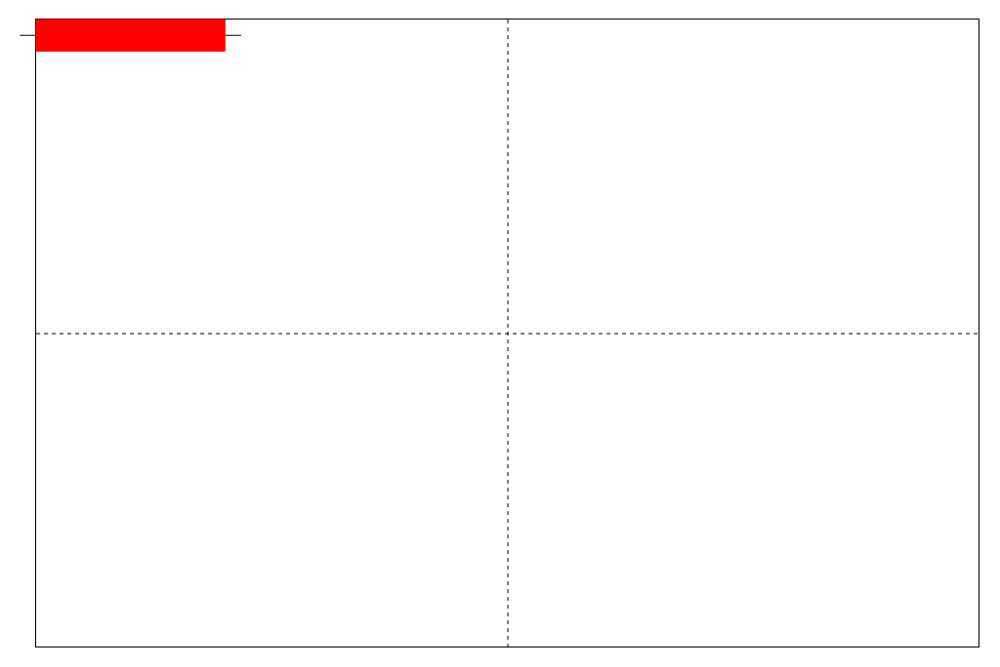
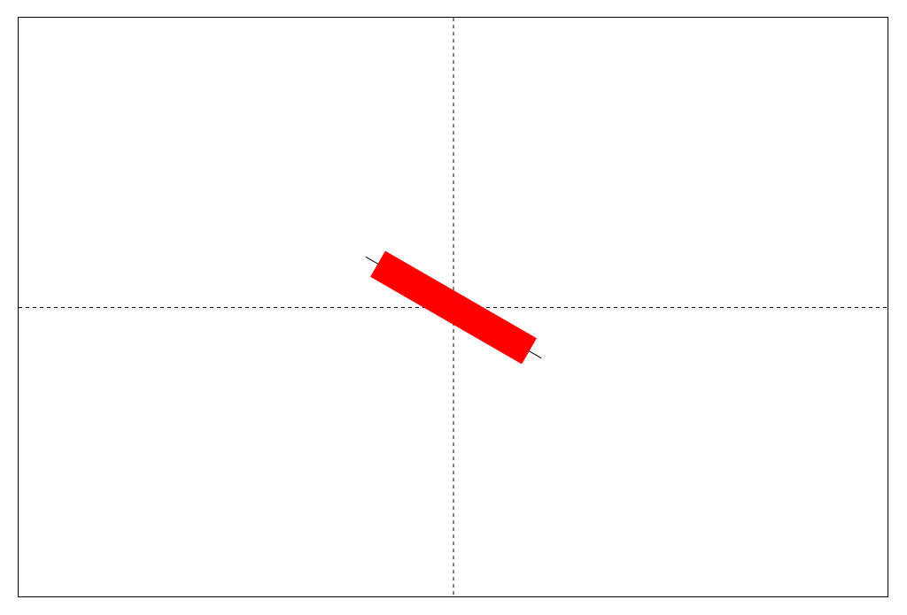
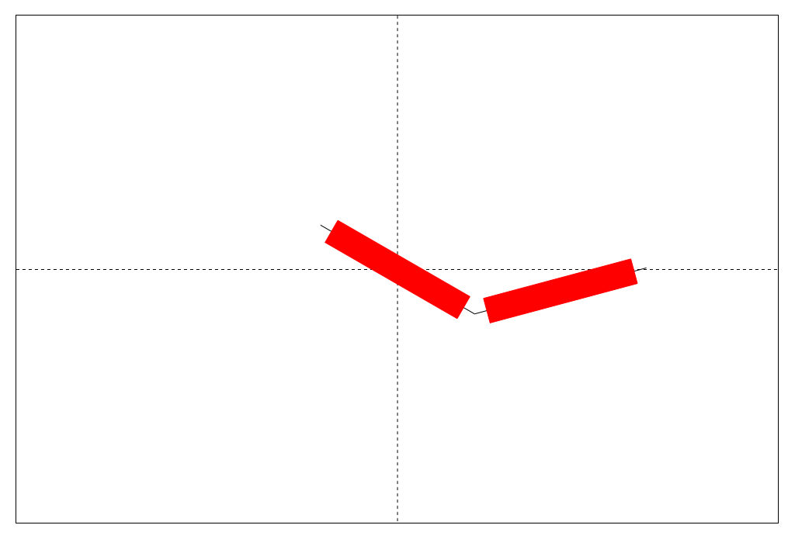
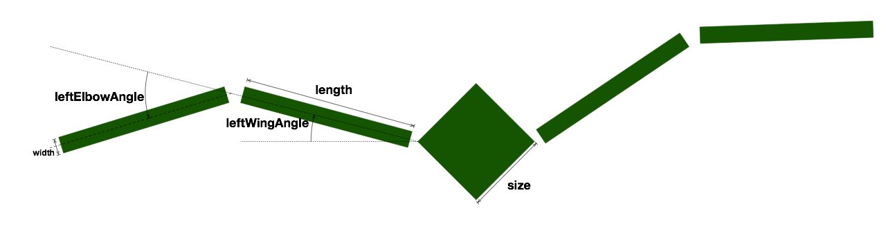

# Tranformacje

## Rozgrzewka

Proszę narysować prostokąt w lewym górnym rogu canvas:
````
ctx.fillRect(0,0,100,20)
````



a następnie  dokonać takich transformacji, aby został narysowany na środku canvas
obrócony o 30 stopni w prawo (zgodnie z ruchem wskazówek zegara) stopni. 



Możliwe rozwiązanie:

1. Przesunąć prostokąt tak aby jego środek znalazł się w punkcie (0,0)
2. Obrócić o zadany kąt
3. Przesunąć na środek

__Pamietamy, że transformacje wykonywane są w odwrotnej kolejności  w stosunku do kodu!
tzn. ostatnia transformacja jest wykonywana pierwsza!__

## Dalsza rozgrzewka

Dodać drugi prostokąt połączony z pierwszym zawiasem o długości 20 na środku krótszego boku.
Zawias powinien być zgięty pod kątem 45 stopni w lewo (przeciwnie do wskazówek zegara). 



Możliwe rozwiązanie: 

Musimy się tylko skoncentrować na drugim prostokącie.  Rysujemy drugi względem pierwszego:

1. Przesuwamy prostokąt tak, aby koniec zawiasu znalazł się w punkcie (0,0)
2. Obracamy o zadany kąt.
3. Przesuwamy tak, aby koniec zawiasu drugiego prostokata, znalazł się na końcu zawiasu pierwszego prostokąta.

__Pamietamy, że transformacje wykonywane są w odwrotnej kolejności  w stosunku do kodu!
tzn. ostatnia transformacja jest wykonywana pierwsza!__


## "Ptasiek"

Za pomocą poleceń 
````
ctx.fillRect(x,y,width, height);
ctx.save();
ctx.restore();
ctx.translate(x,y);
ctx.rotate(angle);
````
proszę zaimplementować  funkcję 
    
    function birdy(ctx, bird);
    
rysującą "ptaszka" :
 


Ptaszek zdefiniowany jest przez parametry obiektu `bird`:
````
bird.length // długość fragmentu skrzydła
bird.width  // szerokość fragmentu skrzydła
bird.size   // długość boku głowy/ciała

bird.leftWingAngle //  kąt pomiędzy ciałem, a lewym skrzydłem
bird.leftElbowAngle // kąt pomiędzy segmentami lewego skrzydła

bird.rightWingAngle //  kąt pomiędzy ciałem, a prawym skrzydłem
bird.rightElbowAngle // kąt pomiędzy segmentami prawego skrzydła
````