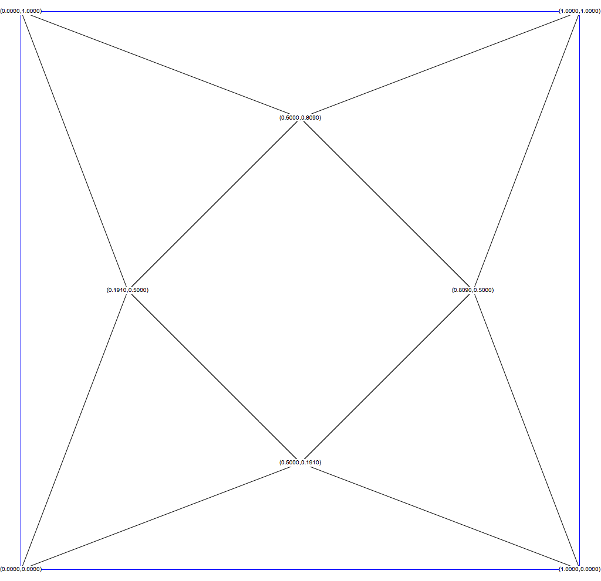

## Textury

W tym ćwiczeniu można korzystać z 
[plików z ostatniego wykładu](https://sorbus.if.uj.edu.pl/~pbialas/3DGraphicsProgramming/).

### Proste tekstury

Proszę oteskturować swoje "modele".

### Piramida

Proszę zamodelować piramidę o podstawie kwadratu o boku długości 2 i wysokości też 2 i oteksturowac ją tak, 
aby na każdej  ściance był inny wzór. Można skorzystać z poniższego szablonu

### Pole piramid

Proszę stworzyć  25 takich piramid i rozmieścić je równomiernie na płaszczyźnie.

### Animacja

Proszę dodać animację  przelotu nad tymi piramidami.